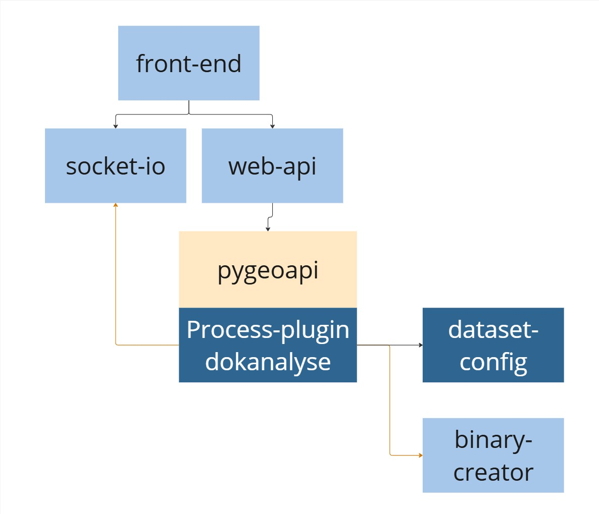

# Arealanalyse av DOK-datasett
Demonstrator for oppsett av arealanalyse basert på pygeoapi

## Forutsetninger for installasjon i eget miljø
- [Docker](https://www.docker.com/)
- [Docker Compose](https://docs.docker.com/compose/)
- [Git](https://git-scm.com/)

Disse verktøyene er nødvendige for å bygge og kjøre applikasjonen i et containerisert miljø.

## Laste ned prosjektet
Start med å laste ned prosjektet

```bash
git clone https://github.com/kartverket/DOK.Arealanalyse.demonstrator.git
cd DOK.Arealanalyse.demonstrator
```

## Komponenter i løsningen



## Justere konfigurasjonen til ditt miljø
juster .env filen som ligger i /pygeoapi katalogen i prosjektet

```ini
PYGEOAPI_API_URL=http://localhost:5000
APP_FILES_DIR=/mnt/dokanalyse
DOKANALYSE_CONFIG_DIR=/mnt/dokconfig
SOCKET_IO_SRV_URL=http://localhost:5002/
AR5_FGDB_PATH=/path/to/ar5.gdb
```
## Kjøre applikasjonene i docker 
```bash
docker-compose up --build
```

## Sette opp volum for konfigurasjonsfiler til analysene
```bash
docker run -v C:/dev/kartverket/DOK.arealanalyse.demo/DOK.Arealanalyse.demonstrator/config:/mnt/dokconfig pygeoapi-pygeoapi-1
```

## Tilgang til images for Docker
TODO - nå bak Azure Container Registry tilgang
```powershell
az login
az acr login --name crdokanalyse
```

## Markedsplass
Beskrivelse av tjenesten som er ihht GaiaX for evt publisering av tjenesten i dataspace/markedsplass

[](./gaia-x/self-description.json)
